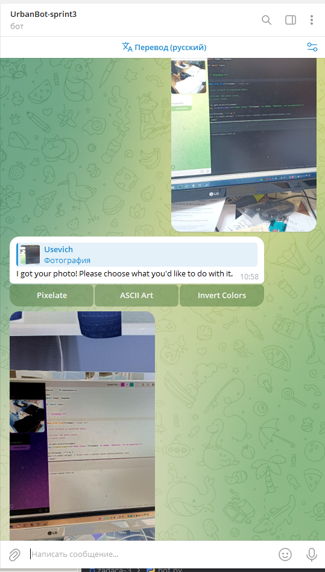

markdown
Copy
# Telegram Bot for Image Processing

Этот бот позволяет обрабатывать изображения, предоставляя два варианта:
1. **Пикселизация** изображения.
2. Преобразование изображения в **ASCII-арт** с возможностью выбора пользовательского набора символов.
3. **Инверсия** изображения.
4. **Отражение** отражает изображение вертикально или горизонтально.
## Установка

1. Убедитесь, что у вас установлен Python 3.8 или выше.
2. Установите необходимые зависимости:

   ```bash
   pip install pyTelegramBotAPI pillow
- Создайте бота в Telegram с помощью BotFather и получите токен.

- Создайте файл "teletoken.txt" куда сохраните ваш TOKEN. 

## Использование
- Запустите бота:
- Отправьте боту изображение.
### Выберите действие:
- Pixelate: Пикселизирует изображение.
- ASCII Art: Преобразует изображение в ASCII-арт. Бот запросит набор символов для создания арта.
- Invert Colors: Инвертирует изображение.
- Mirror Horizontally: Отражает картинку горизонтально.
- Mirror Vertically: Отражает картинку вертикально.

## Пример работы
- Отправьте боту изображение.
- Выберите "ASCII Art".
- Введите набор символов, например: @%#*+=-:.
- Бот отправит вам ASCII-арт, созданный с использованием ваших символов.